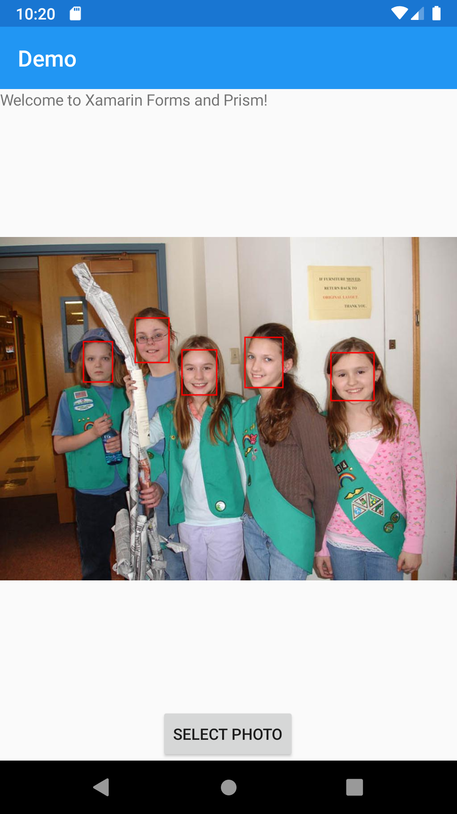
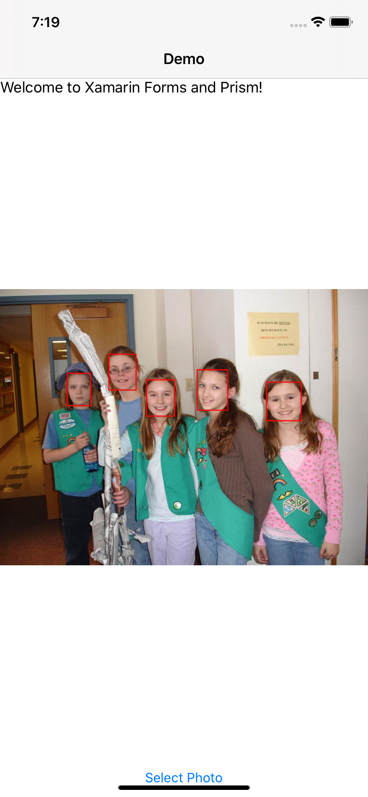
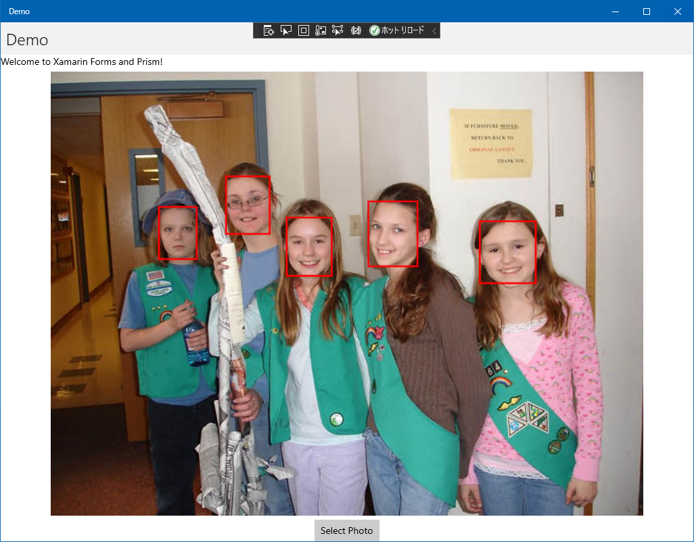

#  UltraFaceDotNet  

C# version of Ultra-Light-Fast-Generic-Face-Detector-1MB
This repository is porting https://github.com/Linzaer/Ultra-Light-Fast-Generic-Face-Detector-1MB by C#.

This package supports cross platform, Windows, MacOS, Linux, iOS and Android!!

|Package|OS|x86|x64|ARM|ARM64|Nuget|
|---|---|---|---|---|---|---|
|UltraFaceDotNet (CPU)|Windows|-|✓|-|-||
||Linux|-|✓|-|✓||
||OSX|-|✓|-|-||
|UltraFaceDotNet (GPU)|Windows|-|✓|-|-||
||Linux|-|✓|-|-||
||OSX|-|✓|-|-||
|UltraFaceDotNet (Xamarin)|UWP|✓|✓|✓|✓||
||Android|✓|✓|✓|✓||
||iOS|-|✓|-|✓||

## Demo

#### Console (using OpenCV UI)

#### YoloV3 on Xamarin.Android, iOS and UWP

 

## Dependencies Libraries and Products

#### [Ultra-Light-Fast-Generic-Face-Detector-1MB](https://github.com/Linzaer/Ultra-Light-Fast-Generic-Face-Detector-1MB/)

> **License:** The MIT License
>
> **Author:** Linzaer
> 
> **Principal Use:** 1MB lightweight face detection model. Main goal of UltraFaceDotNet is what ports Ultra-Light-Fast-Generic-Face-Detector-1MB by C#.

#### [ncnn](https://github.com/Tencent/ncnn/)

> **License:** The BSD 3-Clause License
>
> **Author:** THL A29. Limited, a Tencent company
> 
> **Principal Use:** A high-performance neural network inference framework optimized for the mobile platform in C++. Main goal of UltraFaceDotNet is what wraps ncnn by C#.

#### [OpenCV](https://opencv.org/)

> **License:** The BSD 3-Clause License
>
> **Author:** Intel Corporation, Willow Garage, Itseez
> 
> **Principal Use:** Uses to read and show image data.

#### [NcnnDotNet](https://github.com/takuya-takeuchi/NcnnDotNet/)

> **License:** The MIT License
>
> **Author:** Takuya Takeuchi
> 
> **Principal Use:** Use ncnn interface via .NET. This library is developed by this owner.

#### [ShellProgressBar](https://github.com/Mpdreamz/shellprogressbar/)

> **License:** The MIT License
>
> **Author:** Martijn Laarman
> 
> **Principal Use:** Visualize progress in Benchmark program.

